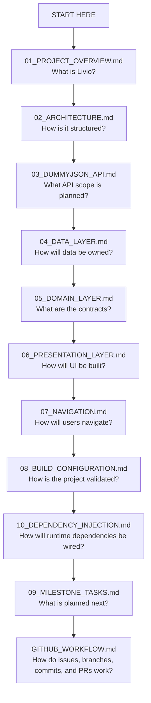

# Livio

**Everything you need for your daily life, in one place.**

Android app for daily-life workflows, built with modular architecture and milestone-based delivery.

**Version:** M0 Foundation  
**Last Updated:** 28 Jun 2026  
**Status:** Foundation / No feature implementation

[](https://github.com/divyarajdev/livio/actions/workflows/quality.yml)


---

## 📚 Documentation Overview

This repository contains Livio Android project documentation for architecture review, implementation planning, GitHub workflow, and milestone delivery.

M0 documents the approved foundation only. Runtime contracts, API integration, data persistence, UI, navigation, dependency injection bindings, and release evidence are delivered in later milestones.

---

## 📖 Documentation Files

### Core Documentation

- **[01_PROJECT_OVERVIEW.md](docs/01_PROJECT_OVERVIEW.md)**
  - App purpose
  - Target audience
  - Tech stack
  - Project structure
  - Related surfaces
  - Design system status

- **[02_ARCHITECTURE.md](docs/02_ARCHITECTURE.md)**
  - Modular architecture
  - Clean Architecture boundaries
  - Module responsibilities
  - Dependency direction
  - Architecture guardrails

- **[03_DUMMYJSON_API.md](docs/03_DUMMYJSON_API.md)**
  - DummyJSON API scope
  - Endpoint families
  - PII and logging rules
  - HTTP mock scope
  - M2 traceability ownership

### Layer Documentation

- **[04_DATA_LAYER.md](docs/04_DATA_LAYER.md)**
  - Data ownership
  - Repository boundary
  - DTO and persistence scope
  - M2/M3 ownership

- **[05_DOMAIN_LAYER.md](docs/05_DOMAIN_LAYER.md)**
  - Domain ownership
  - Repository contracts
  - Result, error, and model scope
  - M1 ownership

- **[06_PRESENTATION_LAYER.md](docs/06_PRESENTATION_LAYER.md)**
  - Compose UI ownership
  - UI state and ViewModel boundaries
  - Feature module boundaries
  - M4-M10 ownership

### System Documentation

- **[07_NAVIGATION.md](docs/07_NAVIGATION.md)**
  - Navigation ownership
  - Route contracts
  - Guarded route and deep-link scope
  - M5 ownership

- **[08_BUILD_CONFIGURATION.md](docs/08_BUILD_CONFIGURATION.md)**
  - Gradle baseline
  - JDK and Android SDK requirements
  - Local validation commands
  - GitHub Actions Quality workflow

- **[09_MILESTONE_TASKS.md](docs/09_MILESTONE_TASKS.md)**
  - M0-M12 roadmap
  - Solo delivery estimate
  - M0 task status
  - Milestone exit criteria

- **[10_DEPENDENCY_INJECTION.md](docs/10_DEPENDENCY_INJECTION.md)**
  - Hilt ownership
  - Binding boundaries
  - Scope rules
  - Future DI milestones

### Process Documentation

- **[GITHUB_WORKFLOW.md](docs/GITHUB_WORKFLOW.md)**
  - Issue format
  - Branch format
  - Commit format
  - PR/MR requirements
  - Squash merge rules
  - Label and milestone rules

---

## 🚀 Quick Start Guide

### For New Developers

**Step 1: Read Project Overview**
- Start with [01_PROJECT_OVERVIEW.md](docs/01_PROJECT_OVERVIEW.md).
- Understand the app purpose.
- Review the current M0 foundation state.

**Step 2: Understand Architecture**
- Read [02_ARCHITECTURE.md](docs/02_ARCHITECTURE.md).
- Review the approved module structure.
- Check dependency boundaries before adding code.

**Step 3: Review API Scope**
- Read [03_DUMMYJSON_API.md](docs/03_DUMMYJSON_API.md).
- Review planned DummyJSON endpoint families.
- Confirm API implementation is owned by M2.

**Step 4: Follow Layer Documentation**
- Read [04_DATA_LAYER.md](docs/04_DATA_LAYER.md), [05_DOMAIN_LAYER.md](docs/05_DOMAIN_LAYER.md), and [06_PRESENTATION_LAYER.md](docs/06_PRESENTATION_LAYER.md).
- Review planned ownership before adding contracts or runtime code.
- Keep DTOs and Room entities out of UI.

**Step 5: Setup Environment**
- Clone the repository.
- Install JDK 17.
- Open the project in Android Studio.
- Run the M0 validation commands in Git Bash.

---

## 🏗️ Project Structure Quick Reference

**Package root:** `io.github.divyarajdev.livio`

```text
Livio/
|-- app/                         # Android application module
|   `-- src/main/kotlin/...      # io.github.divyarajdev.livio
|-- core/                        # Shared core modules
|   |-- common/                  # Shared primitives
|   |-- config/                  # Configuration contracts
|   |-- model/                   # Domain-safe models
|   |-- mvi/                     # MVI contracts
|   |-- domain/                  # Repository and use case contracts
|   |-- network/                 # Network contracts and DTO boundary
|   |-- data/                    # Repository implementation boundary
|   |-- database/                # Room boundary
|   |-- datastore/               # DataStore boundary
|   |-- designsystem/            # Material theme and design tokens
|   |-- ui/                      # Shared UI components
|   |-- navigation/              # Typed routes and deep links
|   `-- testing/                 # Shared test support
|-- feature/                     # Feature module boundaries
|   |-- auth/                    # Identity and session flows
|   |-- users/                   # Users flow
|   |-- products/                # Products flow
|   |-- carts/                   # Carts flow
|   |-- recipes/                 # Recipes flow
|   |-- todos/                   # Todos flow
|   |-- posts/                   # Posts flow
|   |-- comments/                # Comments flow
|   `-- quotes/                  # Quotes flow
|-- build-logic/                 # Local Gradle convention plugins
|-- config/                      # Spotless and Detekt configuration
|-- docs/                        # Project documentation
|-- gradle/                      # Wrapper metadata and version catalog
`-- .github/                     # GitHub Actions and Dependabot configuration
```

---

## 🎨 Key Capabilities

### Completed Foundation ✅
- Root Gradle repository base
- Gradle version catalog
- Local build-logic convention plugins
- Approved app, core, and feature module registration
- GitHub Actions Quality workflow
- Baseline repository documentation

### In Progress 🔄
- M0 baseline documentation alignment
- GitHub issue, PR/MR, and milestone workflow cleanup
- Root README and docs index cleanup
- Project overview and architecture wording review

### Planned Capabilities 📋
- Core contracts
- DummyJSON API integration
- Offline data layer
- Design system and shared UI
- Typed navigation
- Identity and profile flows
- Shopping flows
- Recipes and todos flows
- Social and quotes flows
- App hardening and release candidate evidence

---

## 🎯 Color Theme

**Livio Design Direction:**
- Material 3 component foundation
- Material 3 Adaptive layout foundation
- Design tokens owned by `:core:designsystem`
- Shared UI components owned by `:core:ui`

**Current M0 State:**
- Final brand colors are not defined in M0.
- Typography, shapes, elevation, and component styling are not defined in M0.
- No hardcoded strings, colors, dimensions, routes, status codes, or animation durations are allowed.

**Planned Theme Work:**
- `LIVIO-M4-001` - Add Material theme
- `LIVIO-M4-002` - Add design tokens
- `LIVIO-M4-008` - Add adaptive previews
- `LIVIO-M4-009` - Cover accessibility previews

See [06_PRESENTATION_LAYER.md](docs/06_PRESENTATION_LAYER.md) for presentation ownership.

---

## 🔐 DummyJSON API Scope

### Planned Endpoint Families

1. **auth** - authentication routes
2. **users** - user profile sample data
3. **products** - product catalog sample data
4. **carts** - cart sample data
5. **recipes** - recipe sample data
6. **posts** - social post sample data
7. **comments** - comment sample data
8. **todos** - task sample data
9. **quotes** - quote sample data

Full endpoint traceability belongs to `LIVIO-M2-001`.

M0 does not add API services, DTOs, repositories, mappers, or network implementation.

See [03_DUMMYJSON_API.md](docs/03_DUMMYJSON_API.md) for API ownership and M2 traceability scope.

---

## 🔨 Development Workflow

### Making Changes

**1. Identify Layer:**
- API or DTO change? -> [03_DUMMYJSON_API.md](docs/03_DUMMYJSON_API.md) and `core/network`
- Domain contract or model? -> [05_DOMAIN_LAYER.md](docs/05_DOMAIN_LAYER.md) and `core/domain` or `core/model`
- Data implementation? -> [04_DATA_LAYER.md](docs/04_DATA_LAYER.md) and `core/data`, `core/database`, or `core/datastore`
- UI or design system change? -> [06_PRESENTATION_LAYER.md](docs/06_PRESENTATION_LAYER.md) and `core/ui`, `core/designsystem`, or `feature/*`
- Navigation change? -> [07_NAVIGATION.md](docs/07_NAVIGATION.md) and `core/navigation` or `app`
- Build or quality change? -> [08_BUILD_CONFIGURATION.md](docs/08_BUILD_CONFIGURATION.md), `build-logic`, `gradle`, `config`, or `.github`

**2. Follow Architecture:**
```text
API DTO -> Mapper -> Domain Model -> Repository Contract -> Use Case -> ViewModel -> Screen
```

**3. Update Documentation:**
- Update the relevant documentation file.
- Keep planned scope and implemented scope separate.
- Do not document behavior that is not implemented.
- Update [09_MILESTONE_TASKS.md](docs/09_MILESTONE_TASKS.md) when milestone scope changes.

### Testing Changes

**1. Local Validation:**
Run in Git Bash:

```bash
./gradlew help
./gradlew projects
./gradlew spotlessCheck --warning-mode all
./gradlew detekt --warning-mode all
./gradlew lintDebug
./gradlew test
```

**2. Device / Emulator Validation:**
- Build and run on device or emulator when the task adds app runtime behavior.
- Test the affected user flow when the task adds feature behavior.
- Skip device validation for documentation-only, Gradle-only, and CI-only tasks.

**3. CI Validation:**
- Confirm the GitHub Actions `Quality` workflow passes.
- Use [08_BUILD_CONFIGURATION.md](docs/08_BUILD_CONFIGURATION.md) for validation ownership.
- Keep fixes inside the owning milestone scope.

**4. Review Validation:**
- Confirm issue scope matches PR scope.
- Confirm no unrelated implementation is included.
- Confirm architecture boundaries match [02_ARCHITECTURE.md](docs/02_ARCHITECTURE.md).
- Confirm workflow rules match [GITHUB_WORKFLOW.md](docs/GITHUB_WORKFLOW.md).

---

## 🐛 Troubleshooting

### Common Issues

**Gradle Cannot Find JDK 17:**
1. Install JDK 17.
2. Set `JAVA_HOME` to the installed JDK.
3. Restart Git Bash or Android Studio.
4. Run:
   ```bash
   ./gradlew help
   ```

**Gradle Sync Fails:**
1. Confirm Android Studio uses JDK 17.
2. Confirm the Gradle wrapper is `9.6.1`.
3. Sync Gradle files again.
4. Run:
   ```bash
   ./gradlew help
   ./gradlew projects
   ```

**Unsupported Compile SDK Warning:**
1. `compileSdk 37` is intentional for Livio.
2. The warning is suppressed in `gradle.properties`.
3. Do not change SDK versions outside an approved Gradle task.
4. Run:
   ```bash
   ./gradlew lintDebug
   ```

**Quality Workflow Fails:**
1. Open the first failing GitHub Actions step.
2. Reproduce the failing command locally in Git Bash.
3. Fix only the owning task scope.
4. Run:
   ```bash
   ./gradlew help
   ./gradlew projects
   ./gradlew spotlessCheck --warning-mode all
   ./gradlew detekt --warning-mode all
   ./gradlew lintDebug
   ./gradlew test
   ```

**Feature Code Appears In M0:**
1. M0 is foundation-only.
2. Move runtime code to the owning future milestone.
3. Keep M0 limited to repository setup, tooling, modules, workflow, and docs.
4. Run:
   ```bash
   ./gradlew projects
   ```
   
---

## 📱 Release Readiness

### 1. M0 Preparation
- [ ] Root Gradle project loads.
- [ ] Approved modules are registered.
- [ ] Quality workflow passes.
- [ ] Baseline documentation exists.
- [ ] No feature implementation is present.

### 2. Local Validation
```bash
./gradlew help
./gradlew projects
./gradlew spotlessCheck --warning-mode all
./gradlew detekt --warning-mode all
./gradlew lintDebug
./gradlew test
```

Expected result: all commands pass locally in Git Bash.

### 3. GitHub Validation
- Confirm the GitHub Actions `Quality` workflow passes.
- Confirm the PR scope matches the linked issue.
- Confirm no release signing, publishing, or distribution work is included.

### 4. Future Release Candidate
- Release build validation belongs to M12.
- Release package generation belongs to M12.
- Signing readiness belongs to M12.
- Release artifacts, screenshots, QA evidence, and demo video script belong to M12.

See [09_MILESTONE_TASKS.md](docs/09_MILESTONE_TASKS.md) for milestone ownership.

---

## 👥 Team Roles

### Developer

- Implement one scoped change per PR.
- Keep the project buildable after each change.
- Add tests for implemented behavior.
- Update documentation when behavior, workflow, or architecture changes.

### Reviewer

- Verify architecture boundaries.
- Confirm local validation and CI results.
- Confirm PR scope matches the linked issue.
- Confirm no unrelated implementation is included.

### Maintainer

- Keep milestones and issue status accurate.
- Keep issue, branch, commit, and PR formats consistent.
- Close issues only after validation, review, and merge.

---

## 📞 Support

### For Developers

- Identify the owning issue and milestone.
- Read the relevant documentation file.
- Check the affected module `README.md`.
- Keep changes inside the approved scope.
- Run the required Gradle validation commands.
- Review GitHub Actions logs if CI fails.

### For Reviewers

- Use [GITHUB_WORKFLOW.md](docs/GITHUB_WORKFLOW.md) for PR expectations
- Use [02_ARCHITECTURE.md](docs/02_ARCHITECTURE.md) for boundary checks
- Use [09_MILESTONE_TASKS.md](docs/09_MILESTONE_TASKS.md) for milestone ownership

---

## 🔄 Documentation Updates

### When to Update

**After Capability Implementation:**

- Update affected layer documentation.
- Add validation evidence when required.
- Update [09_MILESTONE_TASKS.md](docs/09_MILESTONE_TASKS.md) when the scoped work is complete.
- Update root `README.md` only when setup, workflow, or documentation index changes.

**After Bug Fix:**

- Update troubleshooting if the issue can recur.
- Add regression coverage when behavior was affected.
- Document changed validation commands or failure modes.
- Update related issue or PR notes with the fix scope.

**After Architecture Change:**

- Update [02_ARCHITECTURE.md](docs/02_ARCHITECTURE.md).
- Update affected layer documentation.
- Update [GITHUB_WORKFLOW.md](docs/GITHUB_WORKFLOW.md) only if process changes.
- Update diagrams or navigation maps if structure changes.
- Confirm root `README.md` links still resolve.

---

## 📈 Version History

### M0 Foundation

- Root Gradle project created
- Gradle version catalog added
- Build convention plugins added
- Approved modules registered
- Quality workflow added
- Baseline documentation added

### Planned Git Tags

- `v0.0.0-m0-foundation` - Foundation complete
- `v0.1.0-m1-core-contracts` - Core contracts complete
- `v0.2.0-m2-network-api` - Network and API complete
- `v0.3.0-m3-data-offline` - Data and offline complete
- `v0.4.0-m4-design-system-ui` - Design system and shared UI complete
- `v0.5.0-m5-navigation` - Navigation complete
- `v0.6.0-m6-identity` - Identity complete
- `v0.7.0-m7-shopping` - Shopping complete
- `v0.8.0-m8-recipes-todos` - Recipes and todos complete
- `v0.9.0-m9-social-quotes` - Social and quotes complete
- `v0.10.0-m10-app-experience` - App experience complete
- `v0.11.0-m11-hardening` - Hardening complete
- `v1.0.0-rc.1` - Release candidate complete

### Upcoming Milestones

- M1 - Core contracts
- M2 - Network and API
- M3 - Data and offline
- M4 - Design system and shared UI
- M5 - Navigation
- M6 - Identity
- M7 - Shopping
- M8 - Recipes and todos
- M9 - Social and quotes
- M10 - App experience
- M11 - Hardening
- M12 - Release candidate

---

## 🎓 Learning Resources

### Android Architecture

- [Guide to app architecture](https://developer.android.com/topic/architecture)
- [Architecture recommendations](https://developer.android.com/topic/architecture/recommendations)
- [Modularization](https://developer.android.com/topic/modularization)

### Jetpack Compose

- [Jetpack Compose](https://developer.android.com/compose)
- [State in Compose](https://developer.android.com/develop/ui/compose/state)
- [Material 3 in Compose](https://developer.android.com/develop/ui/compose/designsystems/material3)
- [Adaptive layouts](https://developer.android.com/develop/ui/compose/layouts/adaptive)

### App Architecture Libraries

- [Navigation](https://developer.android.com/guide/navigation)
- [Hilt](https://developer.android.com/training/dependency-injection/hilt-android)
- [Room](https://developer.android.com/training/data-storage/room)
- [DataStore](https://developer.android.com/topic/libraries/architecture/datastore)
- [WorkManager](https://developer.android.com/topic/libraries/architecture/workmanager)
- [Paging 3](https://developer.android.com/topic/libraries/architecture/paging/v3-overview)

### Kotlin And Networking

- [Kotlin coroutines on Android](https://developer.android.com/kotlin/coroutines)
- [Kotlinx Serialization](https://github.com/Kotlin/kotlinx.serialization/blob/master/docs/serialization-guide.md)
- [Retrofit](https://square.github.io/retrofit/)
- [OkHttp](https://square.github.io/okhttp/)
- [DummyJSON API](https://dummyjson.com/docs)

### Images, Build, And Quality

- [Coil Compose](https://coil-kt.github.io/coil/compose/)
- [Gradle Version Catalogs](https://docs.gradle.org/current/userguide/version_catalogs.html)
- [GitHub Actions](https://docs.github.com/en/actions)
- [Detekt](https://detekt.dev/docs/intro/)
- [Spotless](https://github.com/diffplug/spotless)

### Security And Release

- [Play Integrity API](https://developer.android.com/google/play/integrity)
- [Android App Bundles](https://developer.android.com/guide/app-bundle)

---

## 📝 Contributing Guidelines

### Code Style

- Follow official Kotlin coding conventions.
- Use clear names for modules, packages, classes, functions, and variables.
- Add KDoc for public APIs.
- Keep functions focused and testable.
- Use project constants, resources, design tokens, and typed routes instead of hardcoded values.
- Do not hardcode strings, colors, dimensions, routes, status codes, or animation durations.

### Commit Messages

Use Conventional Commit format with a Livio issue reference footer.

```text
<type>(<scope>): <short description>

Refs: LIVIO-M<#>-<###>
```

Examples:

```text
docs(repo): add baseline project docs

Refs: LIVIO-M0-006
```

```text
chore(gradle): add version catalog

Refs: LIVIO-M0-002
```

```text
feat(core-domain): add result contract

Refs: LIVIO-M1-001
```

### Pull Request Process

1. Create a scoped GitHub issue.
2. Create a branch from the issue key.
3. Implement one scoped change that builds successfully.
4. Run the required Gradle validation commands in Git Bash.
5. Open a pull request using the project PR template.
6. Confirm GitHub Actions passes.
7. Squash and merge after review approval.

---

## ⚖️ License

This project is licensed under the Apache License, Version 2.0. See the [LICENSE](LICENSE) file for
details.

---

## 📧 Contact

**Project Owner:** Divyaraj D  
**Repository:** `divyarajdev/livio`

---

## 🙏 Acknowledgments

- Android platform and Jetpack documentation
- Kotlin and Kotlinx Serialization
- Jetpack Compose and Material 3
- Hilt dependency injection
- Retrofit and OkHttp
- Room, DataStore, WorkManager, and Paging
- Coil image loading
- Detekt, Spotless, and Gradle
- GitHub Actions
- DummyJSON public sample API

---

**Last Updated:** 28 Jun 2026  
**Next Review:** After M0 completion

---

## 📍 Navigation Map


